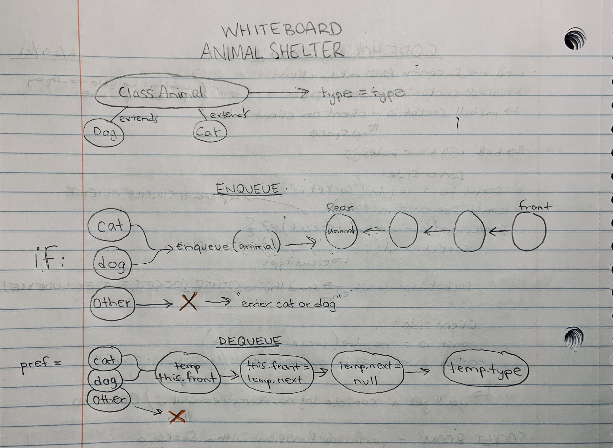

# First-in, First out Animal Shelter
<!-- Short summary or background information -->
First-in, First out Animal Shelter.

## Challenge
<!-- Description of the challenge -->


## Approach & Efficiency
<!-- What approach did you take? Why? What is the Big O space/time for this approach? -->

#### Approach:
My approach was to create a more in-depth visual than I have been. I found it helpful to 'define' the Animal constructor and its children, along with its properties. 

#### Big O:
`enqueue` is O(1) - `dequeue` is O(n^2)

#### Visual:



## Algorithm
<!-- Description of each method publicly available to your Linked List -->

1. create a new constructor
2. for enqueue, if the Animal is a dog or cat, push a value to the rear of the stack
3. for dequeue, if the front is empty and while the rear is **not** empty, return the value of the temp.type


## PseudoCode

```js
class Animal(type)
  type = type

class AnimalShelter 
    front = null
    rear = null
  }
  enqueue(animal) 
    if animal === dog or cat
      front = animal
      rear = animal
    else 'enter cat or dog'
  }
  dequeue() {
    if (pref === cat or dog) {
      let temp = front
      front = temp.next
      temp.next = null
      return temp.type
      }
    }
    return
  }
}
```

## Reference

I used Jacob Knaack's (of Code Fellows) demo code as a guide to writing my code.

