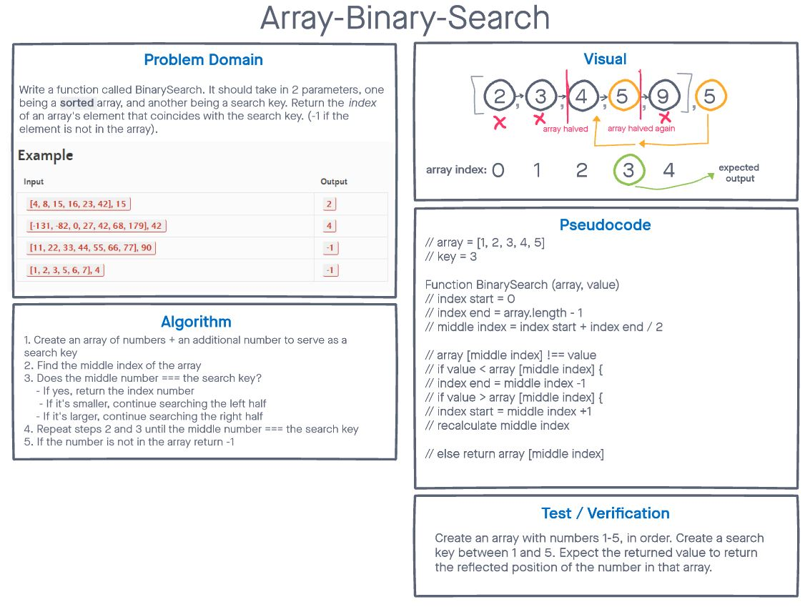

# Array Binary Search
<!-- Description of the challenge -->

> Write a function called BinarySearch which takes in 2 parameters: a sorted array and the search key. Without utilizing any of the built-in methods available to your language, return the index of the array’s element that is equal to the value of the search key, or -1 if the element is not in the array.

## Whiteboard Process
<!-- Embedded whiteboard image -->

## Approach & Efficiency
<!-- What approach did you take? Discuss Why. What is the Big O space/time for this approach? -->

The approach I used was honestly leaning heavily on the prompt of the code challenge. In particular, this GIF helped me with how I approached the problem:

Once I realized that you could just continuously cut what you're searching for in half, I realized it wouldn't be long before you would have the index of the particular number in the array **as long as the list is sorted.** Since you're removing half the potential results every time you search through the array, you should come to the correct number pretty quickly.