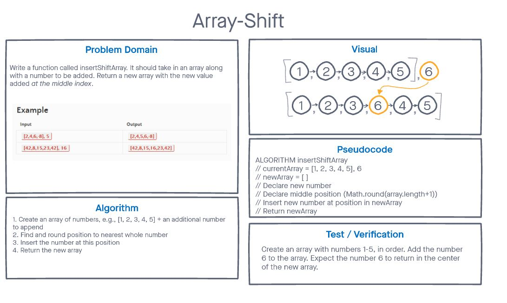

# Insert to Middle of an Array
<!-- Description of the challenge -->

> Write a function called insertShiftArray which takes in an array and a value to be added. Without utilizing any of the built-in methods available to your language, return an array with the new value added at the middle index.

## Whiteboard Process
<!-- Embedded whiteboard image -->

## Approach & Efficiency
<!-- What approach did you take? Discuss Why. What is the Big O space/time for this approach? -->

The approach I used was just breaking down how I thought each individual step of the algorithm would occur, then translating that into pseudocode. That probably sounds pretty obvious, but I usually try to run scripts on replit until I start making progress towards the end result. By breaking down what I need each step of the process to look like, it made it a lot easier to translate into actual code (or close to it).