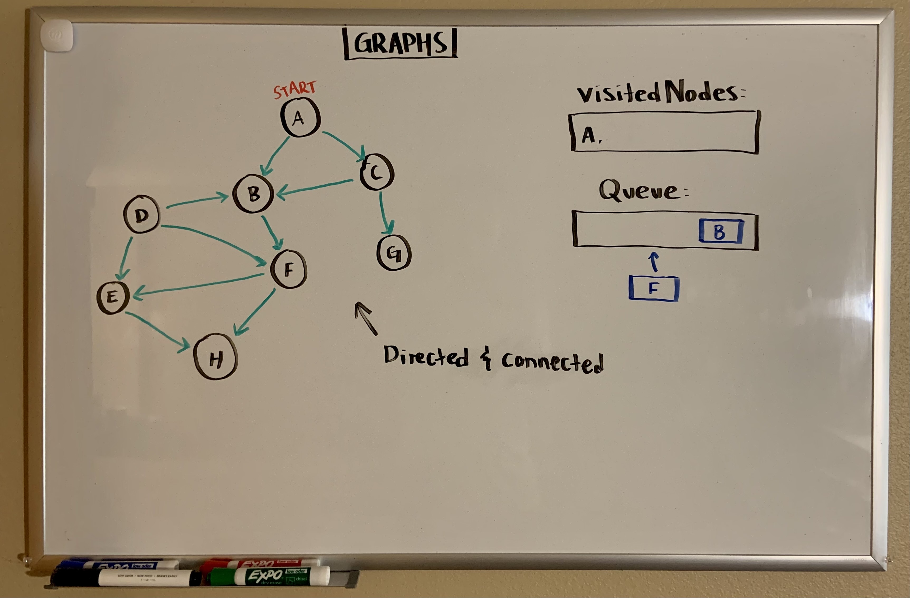
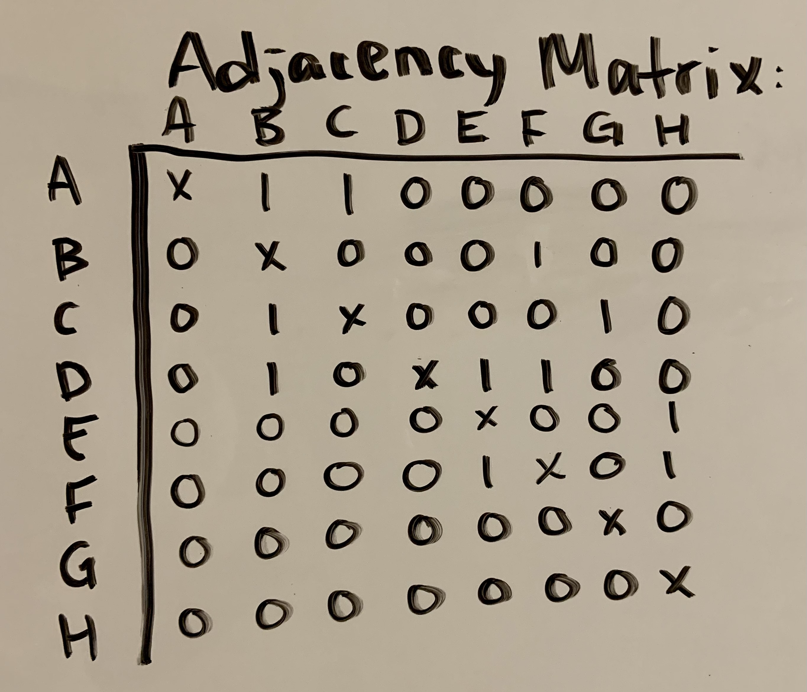

# Graphs
<!-- Short summary or background information -->

Using graphs to find values.

## Challenge
<!-- Description of the challenge -->

Implement your own Graph. The graph should be represented as an adjacency list, and should include the following methods:

    add node
        Arguments: value
        Returns: The added node
        Add a node to the graph
    add edge
        Arguments: 2 nodes to be connected by the edge, weight (optional)
        Returns: nothing
        Adds a new edge between two nodes in the graph
        If specified, assign a weight to the edge
        Both nodes should already be in the Graph
    get nodes
        Arguments: none
        Returns all of the nodes in the graph as a collection (set, list, or similar)
    get neighbors
        Arguments: node
        Returns a collection of edges connected to the given node
            Include the weight of the connection in the returned collection
    size
        Arguments: none
        Returns the total number of nodes in the graph

## Approach & Efficiency
<!-- What approach did you take? Why? What is the Big O space/time for this approach? -->

X's added for my own benefit:

Example Graph:

## Resources
<!-- Description of each method publicly available in your Graph -->

`graph.js` is taken from Jacob Knaack, who worked on it with us as a class.

https://codefellows.github.io/common_curriculum/data_structures_and_algorithms/Code_401/class-35/resources/graphs.html

https://www.rdocumentation.org/packages/PottsUtils/versions/0.3-3/topics/getNeighbors 
