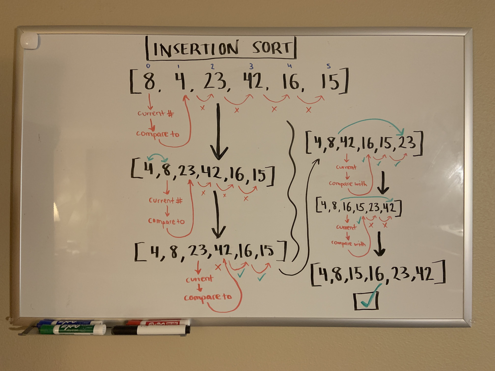

# Insertion Sort

Insertion Sort is a sorting algorithm that traverses an array multiple times as it slowly sorts numbers from lowest to highest. 

## Pseudocode

```js
 InsertionSort(int[] arr)

    FOR i = 1 to arr.length

      int j <-- i - 1
      int temp <-- arr[i]

      WHILE j >= 0 AND temp < arr[j]
        arr[j + 1] <-- arr[j]
        j <-- j - 1

      arr[j + 1] <-- temp
```

## Walkthrough




In the first pass through the array, we first determine the current number. The current number will start at an index of 0, whose value in this case is 8. 

We compare this value to the value of the array at index 1. The value at index 1 is 4, so we shift our current number, 8, to the right. We continue comparing our current number to the other numbers in the array, shifting it right as necessary. In this case, it is only larger than the number 4, so it only moves over one.

In our next pass through the array, we change our current value to 23. We compare this number with every number to the right of its index in the array ([2]), shifting it over as necessary. Since it is larger than some of the numbers in the array, we shift it all the way to the right.

We repeat this process for the remaining numbers until we return a sorted array.

## Efficiency

**Time: O(n^2)**

The basic operation of this algorithm is value comparison. This will happen n * (n-1) number of times, which means the algorithm will be n squared.

**Space: O(1)**

No additional space is being created. This array is being sorted in place, therefore it keeps the space at constant O(1).
