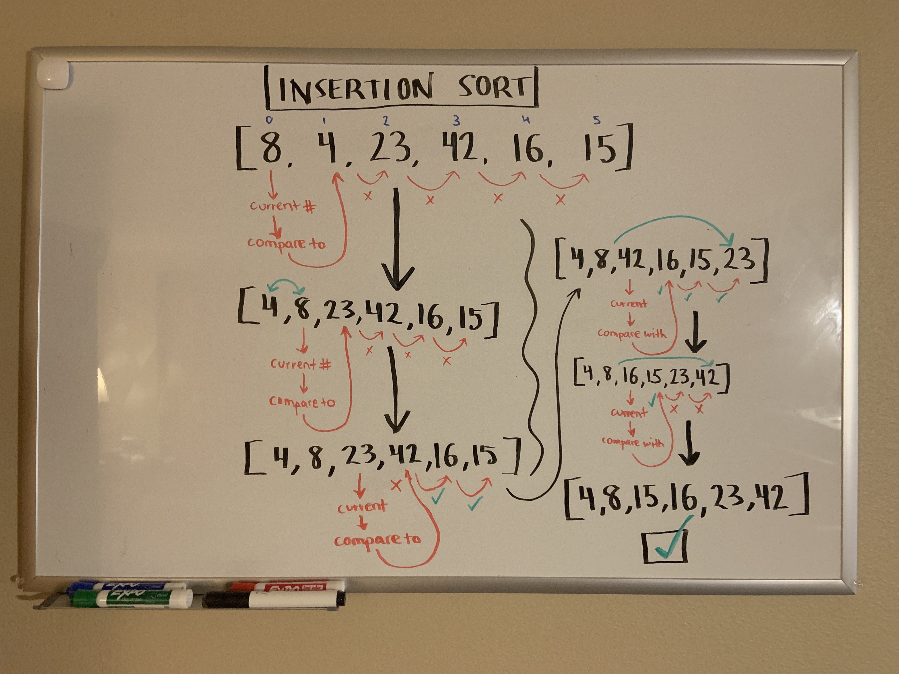

# Insertion Sort
<!-- Description of the challenge -->

Sorting an array!

[Link to blog post](./BLOG.md)

## Whiteboard Process
<!-- Embedded whiteboard image -->

## Approach & Efficiency
<!-- What approach did you take? Why? What is the Big O space/time for this approach? -->

Time: O(n^2)
    The basic operation of this algorithm is value comparison. This will happen n * (n-1) number of times, which means the algorithm will be n squared.

Space: O(1)
    No additional space is being created. This array is being sorted in place, therefore it keeps the space at constant O(1).

## Solution
<!-- Show how to run your code, and examples of it in action -->

Solution is shown in `insertion-sort.js`

## References

When I got stuck, I used https://stackabuse.com/insertion-sort-in-javascript to help guide me. I tried not to straight up see the answer, but rather get a push in the right direction the couple times I was at a sticking point.