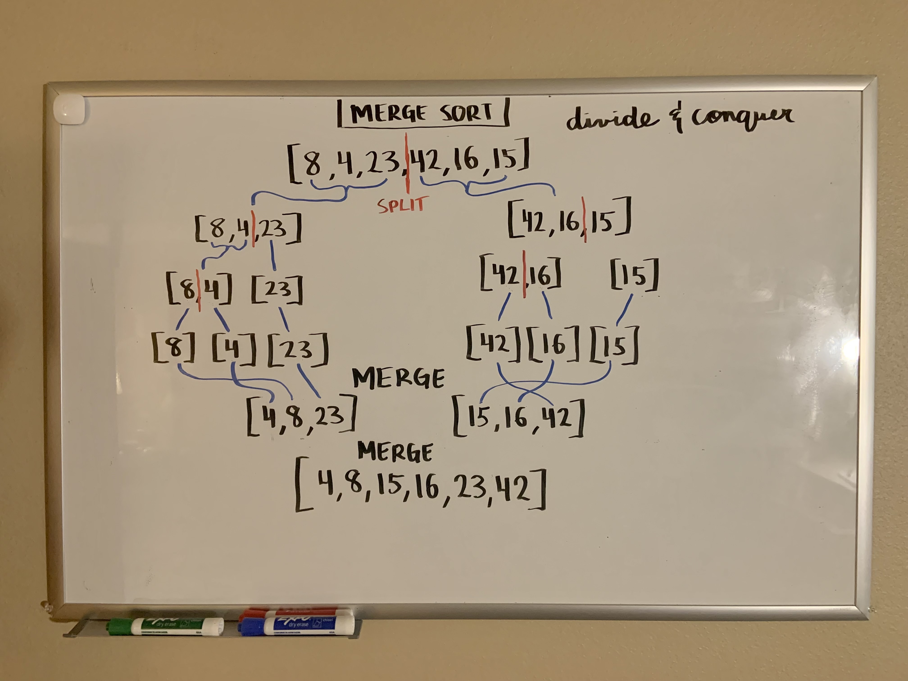

# Merge Sort
<!-- Description of the challenge -->

Merge sorting an array!

[Link to blog post](./BLOG.md)

## Whiteboard Process
<!-- Embedded whiteboard image -->

## Approach & Efficiency
<!-- What approach did you take? Why? What is the Big O space/time for this approach? -->

Time: O(log n)

Space: O(n)

## Solution
<!-- Show how to run your code, and examples of it in action -->

Solution is shown in `merge-sort.js`

## References

When I got stuck, I used https://medium.com/@singhamritpal49/merge-sort-6d7586085936 to help guide me. I tried not to straight up see the answer, but rather get a push in the right direction the couple times I was at a sticking point.