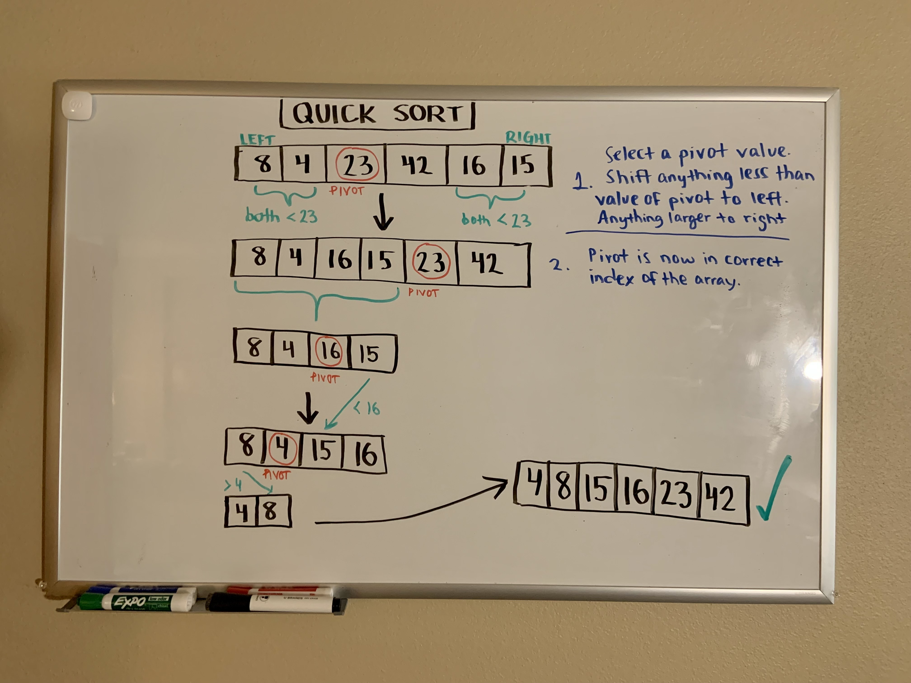

# Quick Sort

Quick sort is another divide and conquer algorithm that determines a `pivot` value to which we compare the other values. 

## Pseudocode

```js

ALGORITHM QuickSort(arr, left, right)
    if left < right
        // Partition the array by setting the position of the pivot value
        DEFINE position <-- Partition(arr, left, right)
        // Sort the left
        QuickSort(arr, left, position - 1)
        // Sort the right
        QuickSort(arr, position + 1, right)

ALGORITHM Partition(arr, left, right)
    // set a pivot value as a point of reference
    DEFINE pivot <-- arr[right]
    // create a variable to track the largest index of numbers lower than the defined pivot
    DEFINE low <-- left - 1
    for i <- left to right do
        if arr[i] <= pivot
            low++
            Swap(arr, i, low)

     // place the value of the pivot location in the middle.
     // all numbers smaller than the pivot are on the left, larger on the right.
     Swap(arr, right, low + 1)
    // return the pivot index point
     return low + 1

ALGORITHM Swap(arr, i, low)
    DEFINE temp;
    temp <-- arr[i]
    arr[i] <-- arr[low]
    arr[low] <-- temp


```

## Walkthrough



We first determine a pivot from a value in our array. We move any value that is smaller than that pivot value to its left, and anything larger than its value to its right. The pivot should now be in its correct spot or index in the array.

We will now have a separate array for values that are lesser than the pivot,
and a separate array for values that are greater than the pivot.

We determine a new pivot, and perform this process recursively until there is only one value or element in each array. That should leave us with a sorted array.

## Efficiency

Time: O(n log n)

Space: O(log n)