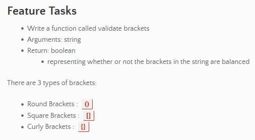

# Multi-bracket Validation
<!-- Short summary or background information -->
Multi-bracket Validation.

## Challenge
<!-- Description of the challenge -->




## Approach & Efficiency
<!-- What approach did you take? Why? What is the Big O space/time for this approach? -->

#### Approach:
My approach was to create a more in-depth visual than I have been. I found it helpful to 'define' the Animal constructor and its children, along with its properties. 


#### Visual:


## Algorithm
<!-- Description of each method publicly available to your Linked List -->

1. create a function called validateBrackets
2. iterate over the items in a string, checking if they're one of the following symbols: `{}`,`()`, or `[]`
3. add those symbols to a new array
4. if a bracket is open (i.e., `{`, `[`, `(`), push it into the stack
5. if the bracket is closed (i.e., `}`, `]`, `)`), pop it out of the stack and compare it with its potential open counterpart in the top of the stack
6. if all the brackets have pairs, return `true`
7. if any of the brackets do not line up, return `false`


## PseudoCode / Code

```js
function validateBrackets(value) {
  let stack = [];
  let openBracket = ['(', '[', '{'];
  let closedBracket = [')', ']', '}'];

  for (let i = 0; i < value.length; i+=1) {

    if (openBracket.indexOf(value[i]) >= 0) {
      stack.push(value[i]);

    } else if (closedBracket.indexOf(value[i]) != openBracket.indexOf(stack.pop())) {
      return false;
    }
  }
}

if (stack.length > 0) {
  return false;
}

return true;
};
  
```

## Reference

[geeks for geeks](https://www.geeksforgeeks.org/check-for-balanced-parentheses-in-an-expression/)

[exercism.io](https://exercism.io/tracks/javascript/exercises/matching-brackets/solutions/c4fb5ba57c6b4abe8dab3ba78ca3d0de)