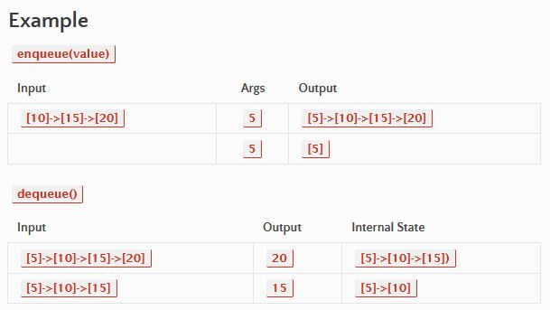

# Stacks and Queues
<!-- Short summary or background information -->

> Implement a Queue using two Stacks.

## Challenge
<!-- Description of the challenge -->

## Approach & Efficiency
<!-- What approach did you take? Why? What is the Big O space/time for this approach? -->

#### Approach:
My approach was to build off what I learned in the stacks-and-queues lecture and code challenge. Using the input/expected output pictured above, I was able to create a step-by-step algorithm. It helped me visualize what exactly was being asked of me.

#### Big O:
`includes()` is O(N) - `insert()` is O(1) - `toString()` is O(N)

## API
<!-- Description of each method publicly available to your Linked List -->

`.insert` inserts a node
`.toEqual`  compares value to expected value
`.insertBefore` inserts a node *before* a specified part of a list
`.insertAfter` inserts a node *after* a specified part of a list

## Reference

I used Jacob Knaack's (of Code Fellows) demo code as a guide to writing my code

