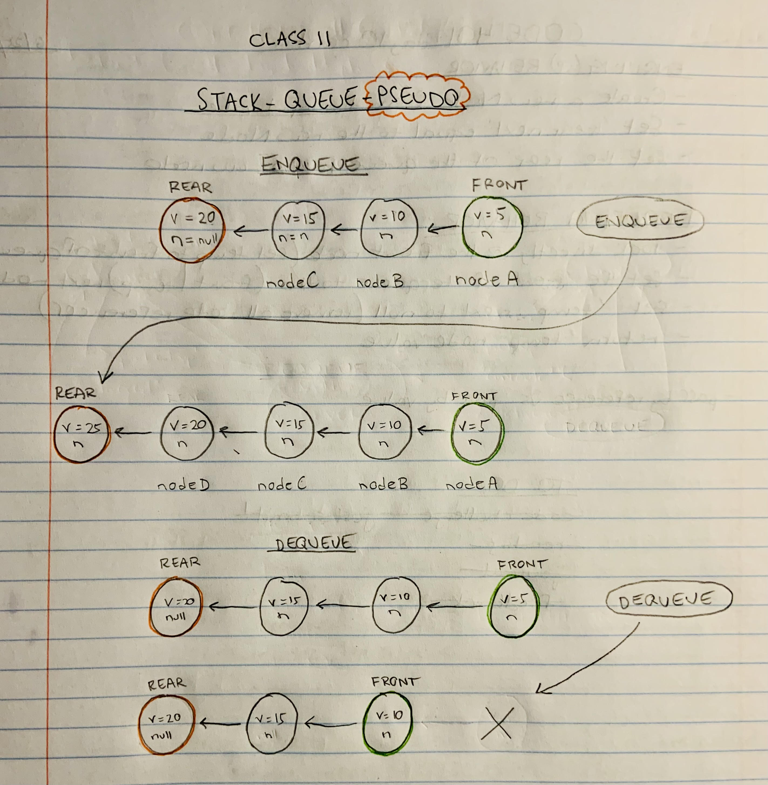

# Stacks and Queues
<!-- Short summary or background information -->

> Implement a Queue using two Stacks.

## Challenge
<!-- Description of the challenge -->


## Approach & Efficiency
<!-- What approach did you take? Why? What is the Big O space/time for this approach? -->

#### Approach:
My approach was to build off what I learned in the stacks-and-queues lecture and code challenge. Using the input/expected output pictured above, I was able to create a step-by-step algorithm. It helped me visualize what exactly was being asked of me.

#### Big O:
`includes()` is O(N) - `insert()` is O(1) - `toString()` is O(N)

#### Visual:



## Algorithm
<!-- Description of each method publicly available to your Linked List -->

1. create a new constructor
2. define new variables as front and rear of new Stack
3. for enqueue, push a value to the rear of the stack
4. for dequeue, if the front is empty and while the rear is **not** empty, push the popped rear onto the front 


## PseudoCode

```js
class Pseudo {
    front = new Stack
    rear = new Stack
  }
  enqueue(value) {
    rear.push(value)
  }
  dequeue() {
    if (front is empty) {
      while (rear is NOT empty) {
        front.push(rear.pop)
      }
    }
    return
  }
}
```

## Reference

I used Jacob Knaack's (of Code Fellows) demo code as a guide to writing my code.

