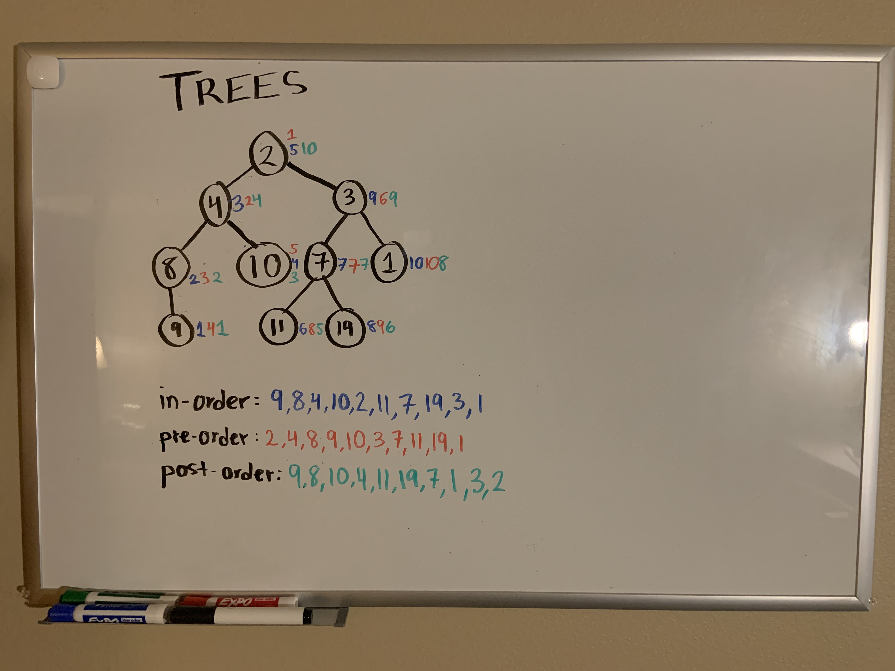

# Trees
<!-- Short summary or background information -->
Binary Tree and BST Implementation 

## Challenge
<!-- Description of the challenge -->

Binary Tree and Binary Search Tree implementation and testing.

7/5/21: Find the maximum value stored in the tree. You can assume that the values stored in the Binary Tree will be numeric.

## Approach & Efficiency
<!-- What approach did you take? Why? What is the Big O space/time for this approach? -->

#### Approach:
My approach was to follow along with Jacob Knaack during lecture. Any parts I was stuck on, I was able to refer to his code and solve any sticking points I was on.

#### Visual:

## Reference

I was assisted by Code Fellows instructor Jacob Knaack's code and lecture. 

I also used the following website to assist me further (along with StackOverflow, of course):
https://towardsdatascience.com/4-types-of-tree-traversal-algorithms-d56328450846 

7/5/21: Jacob Knaack's demo code walked me through this process again, and we all worked on it together as a class.